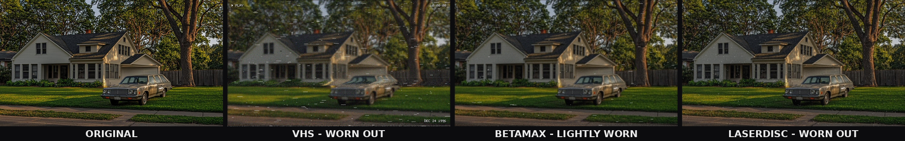
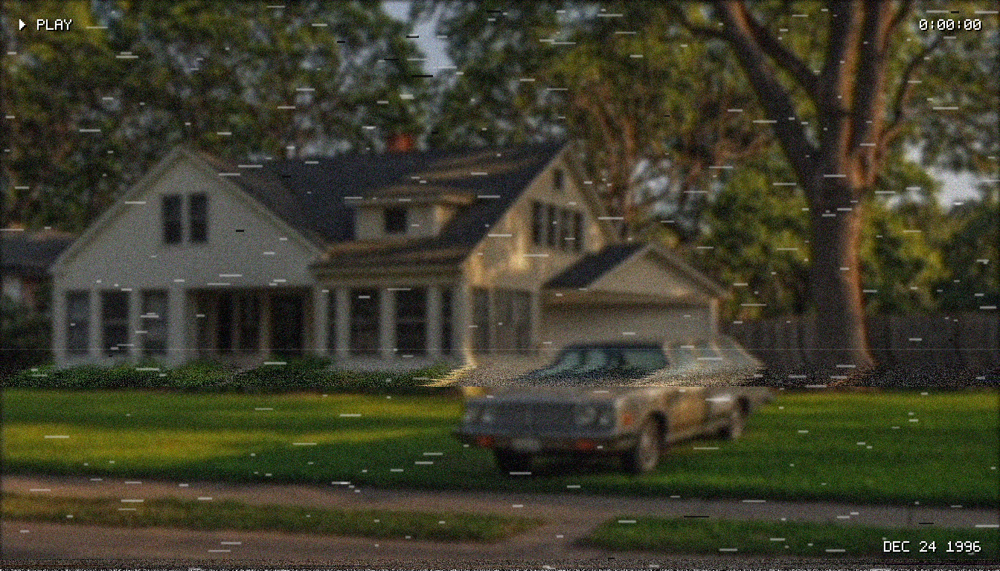
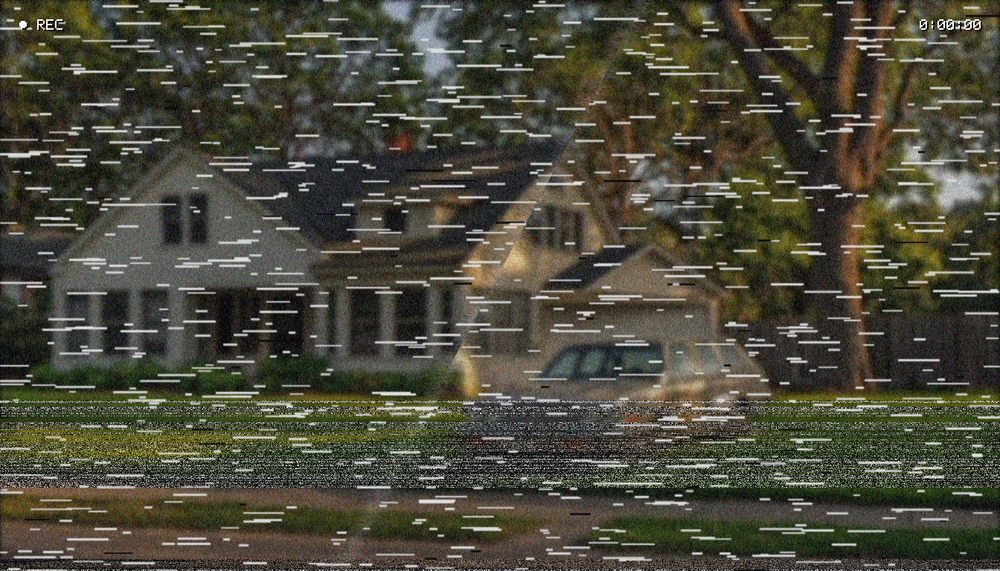
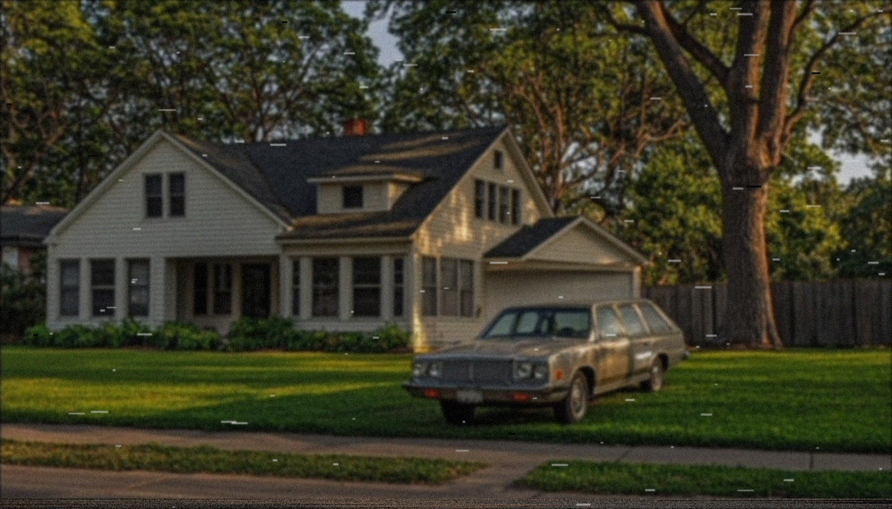
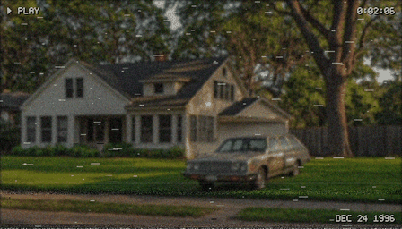

# MiniMax-H3-Tape-FX

**One node. Three dead formats. Infinite damage.**

MiniMax-H3-Tape-FX is a single mega-node for [ComfyUI](https://github.com/comfyanonymous/ComfyUI) that degrades your images and video batches with authentic analog-tape playback artifacts: **VHS**, **BetaMax** and **LaserDisc** — including the *worn out tape* look, tracking errors, dropout, creases, ghosting, head-switch noise, vertical roll and a period-correct VCR on-screen display.



*Left to right: original, VHS (worn out, with OSD), BetaMax (lightly worn), LaserDisc (worn out).*

## Highlights

- **Format DNA** — each format is simulated with its real technical character, not a single filter with different names
- **Six transport damage effects** — tracking error bands, signal dropout, tape creases, frame ghosting, head-switch noise bar, vertical hold roll
- **Worn-section simulation** — damage spikes inside a configurable frame range, exactly like a bad patch of tape
- **Damage presets + full manual control** — `mint` through `destroyed`, every slider always available
- **Authentic VCR OSD** — `PLAY ▶` / blinking `REC ●`, tape counter and date stamp, drawn with a built-in 5x7 pixel font (no font files needed)
- **Video-ready** — the IMAGE batch dimension is treated as a timeline, so temporal effects (tracking, rolls, ghost trails, counter) animate correctly on AnimateDiff / video latent outputs
- **Deterministic** — same seed, same damage, on every machine
- **Zero dependencies** — pure PyTorch + NumPy, both ship with ComfyUI

## Demo

| VHS — worn out | VHS — destroyed |
|---|---|
|  |  |

| BetaMax — lightly worn | LaserDisc — worn out |
|---|---|
|  |  |

Worn-section simulation (animated) — the tape plays fine, then hits the damaged patch at ~0:01, then recovers:



## Installation

1. Inside your ComfyUI folder: `cd custom_nodes/`
2. Either clone this repo or copy the `MiniMax-H3-Tape-FX` folder there:
   ```
   git clone https://github.com/your-name/MiniMax-H3-Tape-FX
   ```
3. Restart ComfyUI. Done — no extra requirements.

## Quick start

1. Add the node: double-click the canvas and search for **MiniMax-H3-Tape-FX** (category `MiniMax-H3-Tape-FX`).
2. Wire any `IMAGE` through it — a `Load Image`, your sampler output, or an AnimateDiff / video batch.
3. Pick a **format** and a **preset**, then fine-tune the sliders.
4. For video: feed the whole batch at once. Set `osd_fps` to your frame rate so the counter and REC blink stay in sync.

An example workflow (`Load Image → MiniMax-H3-Tape-FX → Save Image`) is in [`examples/minimax_h3_tape_fx_workflow.json`](examples/minimax_h3_tape_fx_workflow.json) — drop it onto the ComfyUI canvas.

## The three formats

| | VHS | BetaMax | LaserDisc |
|---|---|---|---|
| Sharpness | soft (~240 lines) | sharper (~270 lines) | sharpest analog (~420 lines) |
| Chroma bleed | heavy | moderate | light |
| Tape noise / flicker | high | medium | low |
| Dropout style | long white streaks | shorter streaks | "laser rot" speckles |
| Head-switch bar | yes | yes | no (no tape transport) |
| Tape creases | yes | yes, milder | never (optical media) |
| Tracking errors | frequent | steadier (Beta tracked better) | mild timebase jitter |
| Ghosting | moderate | light | strong crosstalk echo |
| Black level | lifted grays | slightly lifted | near-black |

Even a **mint** VHS stays soft and bleeds a little — that's the format's bandwidth, not damage. LaserDisc never creases and has no head-switch bar, but old discs rot: sparkle dropout and crosstalk ghosts instead.

## Presets

Presets are a **global damage multiplier** applied on top of the damage sliders (`mint` 0.08x, `lightly_worn` 0.4x, `worn_out` 1.0x, `destroyed` 1.9x, `custom` 1.0x). The look sliders (softness, bleed, scanlines) are never scaled by presets — a mint VHS is still a soft VHS.

- **mint** — clean playback, format character only
- **lightly_worn** — occasional noise, rare dropout
- **worn_out** — the classic rental tape (default)
- **destroyed** — the tape your VCR ate and you rewound with a pencil
- **custom** — the sliders, exactly as you set them

## Worn sections

Tapes damage in *places*, not uniformly. Set `wear_start` / `wear_end` (frame range, 4-frame ramps) and `wear_boost`, and damage spikes inside that range: more tracking chaos, heavier dropout, extra noise — then the tape plays on as before. Leave `wear_end` <= `wear_start` to disable.

## On-screen display (OSD)

| Option | What it does |
|---|---|
| `osd_mode` | `play` (▶ PLAY), `rec` (blinking ● REC), or `none` — top-left |
| `osd_counter` | Tape counter `h:mm:ss` top-right; `osd_counter_start` sets the starting value in seconds |
| `osd_custom_text` | Your stamp bottom-right — e.g. `DEC 24 1996`, `SP`, `CHR-LOCK` |
| `osd_color` | `white` (classic VCR), `teal` (camcorder), `amber` (date stamp) |
| `osd_scale` | Pixel size of the OSD font — raise it for 2K/4K images |
| `osd_fps` | Frame rate used by the counter and the REC blink |

The OSD uses a built-in 5x7 pixel font supporting `A-Z 0-9 : . - / ( ) '` plus the ▶ and ● symbols (lowercase is converted to uppercase; unsupported characters become spaces).

## Full parameter reference

### Format & preset
| Parameter | Type | Description |
|---|---|---|
| `format` | combo | `vhs` / `betamax` / `laserdisc` |
| `preset` | combo | Global damage level (see above) |

### Damage effects (scaled by preset + wear)
| Parameter | Default | Description |
|---|---|---|
| `tracking` | 0.35 | Tracking error bands: horizontal tearing waves that crawl over the image |
| `dropout` | 0.30 | Signal dropout: white streaks (tape) or rot speckles (LaserDisc) |
| `creases` | 0.25 | Tape creases: diagonal bright kink lines that persist for a while |
| `ghosting` | 0.30 | Frame ghosting / crosstalk: previous frame bleeds through |
| `head_switch` | 0.45 | Head-switching noise bar at the bottom (VHS/BetaMax) |
| `vertical_roll` | 0.15 | Vertical hold failures; low values give gentle vertical jitter |
| `tape_noise` | 0.35 | Analog grain: luma + chroma noise |
| `flicker` | 0.25 | Slow brightness instability |

### Analog look (not scaled by presets)
| Parameter | Default | Description |
|---|---|---|
| `luma_softness` | 0.50 | Video bandwidth — how soft the picture is (scaled by format) |
| `color_bleed` | 0.50 | Composite chroma smear and oversaturation |
| `scanlines` | 0.35 | Interlaced line structure (every other line darker) |

### Worn section
| Parameter | Default | Description |
|---|---|---|
| `wear_start` / `wear_end` | 0 / 0 | Frame range of the bad patch (disable: end <= start) |
| `wear_boost` | 0.60 | How much worse it gets inside the patch |

### OSD
See the table above.

### Misc
| Parameter | Description |
|---|---|
| `seed` | All randomness derives from it — same seed, same damage, CPU or GPU |

## Tips

- **Single stills always show their damage**: a tracking band and (for heavy settings) a crease are guaranteed on frame 0, so the effect you dialed in is visible immediately.
- **Resolution independent**: effect sizes scale with image resolution (calibrated to ~640px reference).
- **Performance**: everything runs on your ComfyUI device (GPU when available). Typical cost is a few dozen small convolutions per frame.
- **Stack it**: the node output is a normal IMAGE — chain two instances (e.g. BetaMax look + extra dropout) or follow it with any color/grade node.
- **Performance at 4K**: raise `osd_scale` to keep the OSD proportional.

## File structure

```
MiniMax-H3-Tape-FX/
├── __init__.py                    # ComfyUI entry point
├── minimax_h3_tape_fx.py          # The node (pure torch + numpy)
├── examples/
│   ├── minimax_h3_tape_fx_workflow.json
│   └── demo/                      # All images in this README
└── LICENSE                        # MIT
```

## License

MIT — see [LICENSE](LICENSE).
